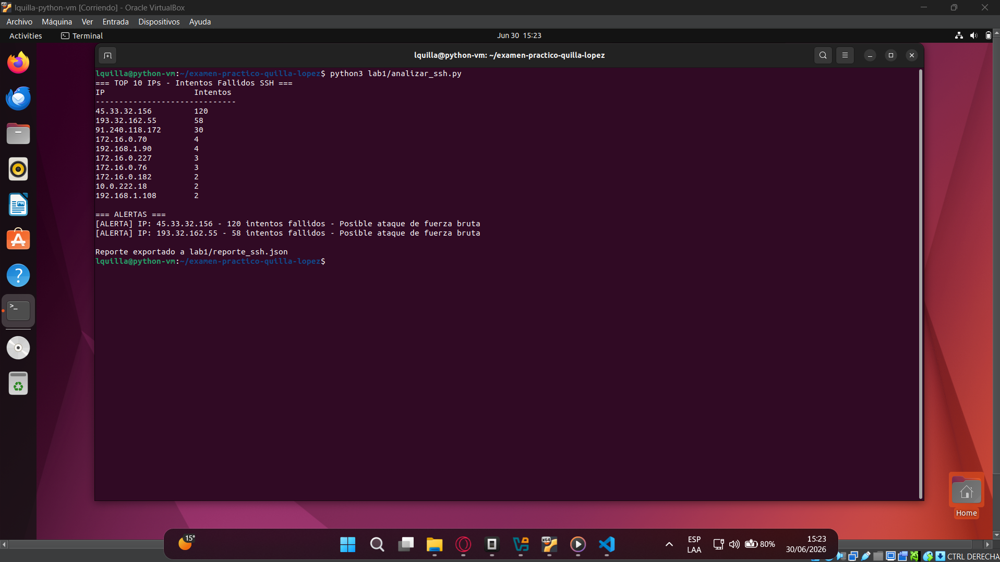
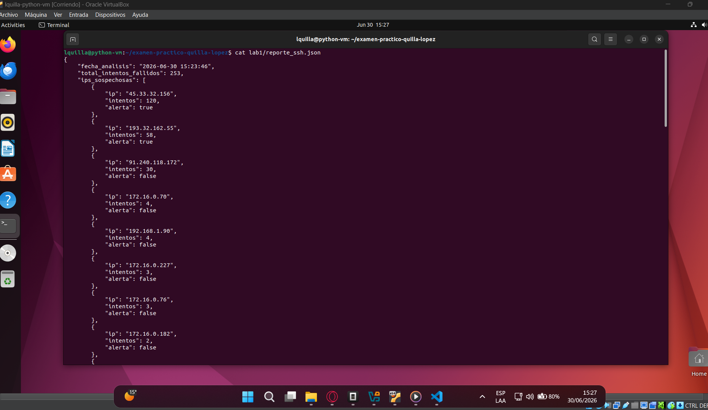
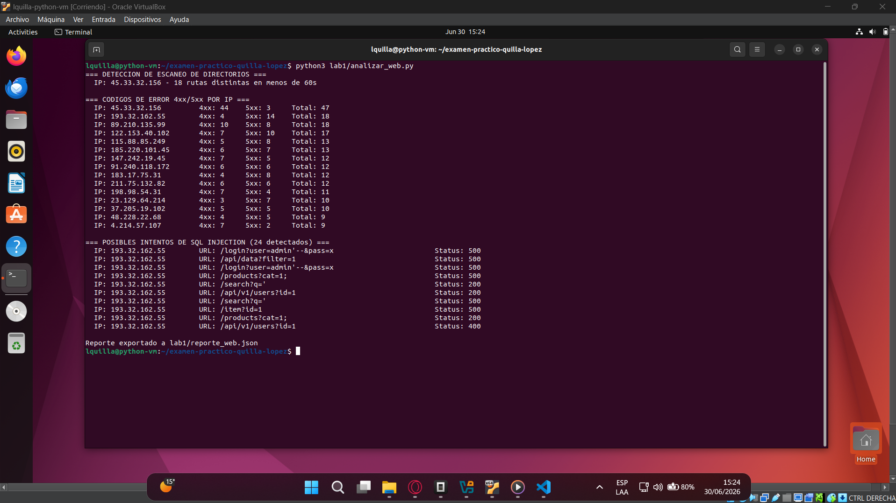
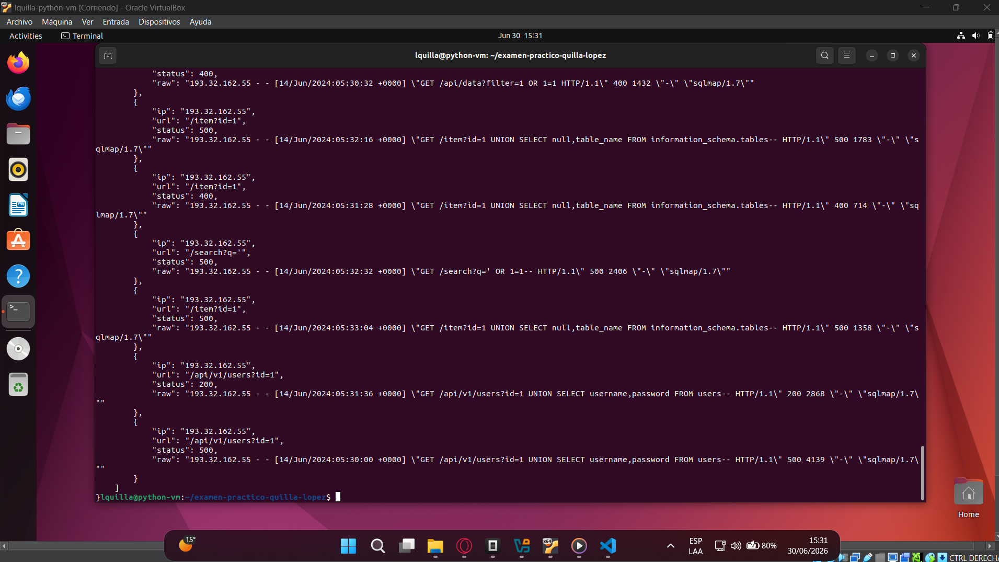
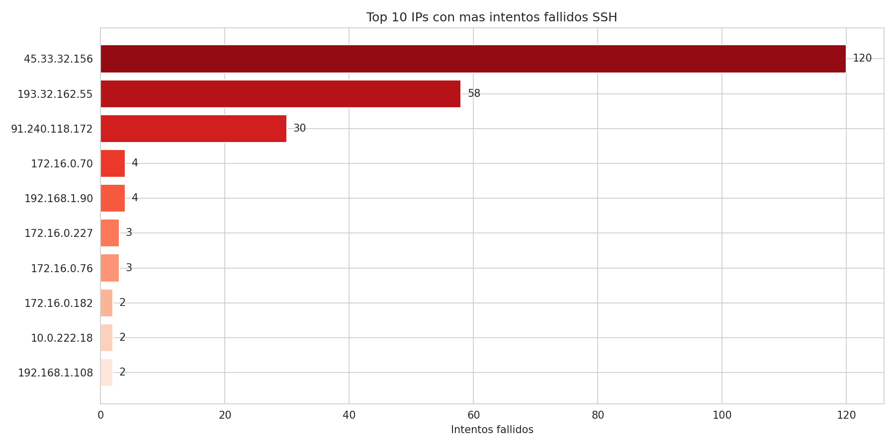
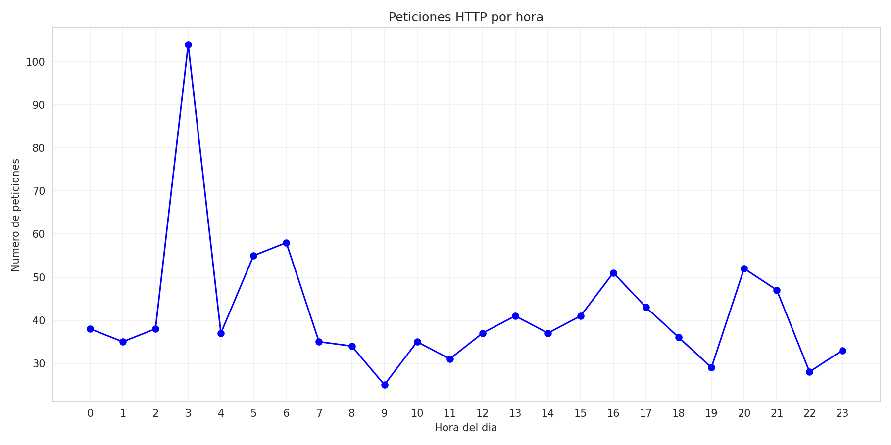
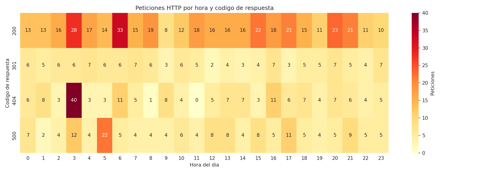
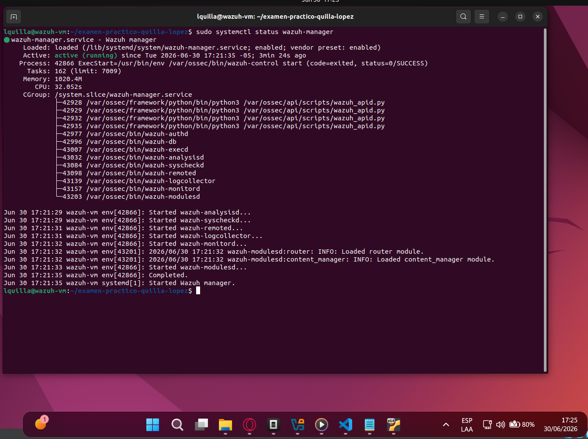
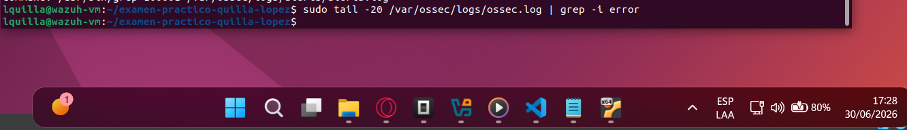
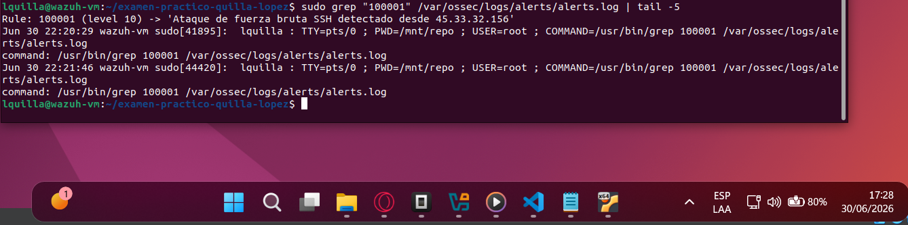

# Examen Práctico Final - Seguridad Informática

**Estudiante:** Luis Alberto Quilla Lopez  
**Ciclo:** IX - Ingeniería de Sistemas  
**Curso:** Seguridad Informática  
**Unidad:** IV - Monitoreo de Seguridad, SIEM e Inteligencia Artificial  
**Fecha:** 30/06/2026

---

## Arquitectura del Proyecto

Se utiliza una arquitectura de **2 máquinas virtuales en VirtualBox** con Ubuntu 22.04 LTS:

```
┌─────────────────────────────────────────────────────┐
│                  HOST (Windows)                      │
│  - Editor de código (VS Code)                        │
│  - Acceso a dashboards vía navegador                 │
│  - Cliente Git                                       │
└────────────────────┬────────────────────────────────┘
                     │
     ┌───────────────┴───────────────┐
     │                               │
     ▼                               ▼
┌─────────────────┐     ┌─────────────────────────┐
│   VM1: wazuh-vm  │     │   VM2: python-vm         │
│   Ubuntu 22.04   │     │   Ubuntu 22.04           │
│   4 GB RAM       │     │   4 GB RAM               │
│   2 vCPU         │     │   2 vCPU                 │
│   25 GB disco    │     │   25 GB disco            │
│   Red: NAT       │     │   Red: NAT               │
│                   │     │                          │
│ LABORATORIO 2    │     │ LABORATORIO 1            │
│  - Wazuh Manager  │     │  - Python 3.11+          │
│  - Reglas de      │     │  - analizar_ssh.py       │
│    correlación    │     │  - analizar_web.py       │
│                   │     │  - visualizar.py         │
│ LABORATORIO 4    │     │                          │
│  - Elasticsearch  │     │ LABORATORIO 3            │
│  - Kibana         │     │  - Jupyter Notebook      │
│  - Dashboard SOC  │     │  - Isolation Forest      │
│  - Alertas        │     │  - predecir.py           │
└─────────────────┘     └─────────────────────────┘
```

### Especificaciones del Host

- **Sistema:** Windows 11
- **RAM:** 16 GB
- **Procesador:** (compatible con virtualización)
- **VirtualBox:** 7.x
- **Almacenamiento:** SSD disponible

---

## Configuración del Entorno

### VM1 - wazuh-vm (Lab 2 + Lab 4)

```bash
# Actualizar sistema
sudo apt update && sudo apt upgrade -y

# Instalar dependencias
sudo apt install -y curl wget git unzip apt-transport-https software-properties-common

# Instalar Wazuh All-in-One (incluye Elasticsearch + Kibana)
curl -sO https://packages.wazuh.com/4.9/wazuh-install.sh
sudo bash wazuh-install.sh -a

# Verificar estado
sudo systemctl status wazuh-manager
sudo systemctl status elasticsearch
sudo systemctl status kibana

# Acceder a Kibana: https://<IP_VM1>:5601
# Credenciales generadas durante la instalación
```

### VM2 - python-vm (Lab 1 + Lab 3)

```bash
# Actualizar sistema
sudo apt update && sudo apt upgrade -y

# Instalar Python 3.11+
sudo apt install -y python3 python3-pip python3-venv git

# Verificar versión
python3 --version

# Instalar librerías pip
pip3 install pandas matplotlib seaborn scikit-learn joblib notebook

# Verificar instalación
pip3 list | grep -E "pandas|matplotlib|seaborn|scikit-learn|joblib|notebook"
```

---

## Estado del Proyecto

| Laboratorio | Estado |
|-------------|--------|
| Lab 1 - Análisis Forense de Logs con Python | ✅ Completado |
| Lab 2 - Reglas de Correlación en Wazuh | ✅ Completado |
| Lab 3 - Modelo ML de Detección de Anomalías | ⏳ Pendiente |
| Lab 4 - Dashboard de Monitoreo | ⏳ Pendiente |

---

## Laboratorios

### Laboratorio 1: Análisis Forense de Logs con Python (5 pts) ✅

**Ubicación:** VM2 (python-vm) - `lab1/`

**Scripts:**
- `analizar_ssh.py` - Parsea `auth.log`, detecta fuerza bruta SSH, genera `reporte_ssh.json`
- `analizar_web.py` - Parsea `access.log`, detecta escaneo de directorios y SQLi, genera `reporte_web.json`
- `visualizar.py` - Genera 3 gráficas PNG (top10 SSH, timeline HTTP, heatmap HTTP)

**Ejecución:**
```bash
cd ~/examen-practico-quilla-lopez
python3 lab1/analizar_ssh.py
python3 lab1/analizar_web.py
python3 lab1/visualizar.py
```

#### Evidencias

**SCR-1.1a** - Ejecución de `analizar_ssh.py` con alertas de fuerza bruta:


**SCR-1.1b** - Contenido de `reporte_ssh.json`:


**SCR-1.2a** - Ejecución de `analizar_web.py` con detecciones de escaneo y SQLi:


**SCR-1.2b** - Contenido de `reporte_web.json`:


#### Gráficas Generadas

**Top 10 IPs con más intentos fallidos SSH:**


**Línea de tiempo - Peticiones HTTP por hora:**


**Mapa de calor - Peticiones HTTP por hora y código de respuesta:**


---

### Laboratorio 2: Reglas de Correlación en Wazuh (4 pts) ✅

**Ubicación:** VM1 (wazuh-vm) - `lab2/`

**Archivos de reglas:**
- `local_rules_ssh.xml` - Regla para detectar fuerza bruta SSH (≥10 fallos en 60s, severidad 10)
- `local_rules_exfil.xml` - Regla para detectar exfiltración de datos (>500MB saliente + login fuera de horario, severidad 14)

**Instalación:**
```bash
sudo cp lab2/local_rules_ssh.xml /var/ossec/etc/rules/
sudo cp lab2/local_rules_exfil.xml /var/ossec/etc/rules/
sudo systemctl restart wazuh-manager
```

**Prueba:**
```bash
# Ejecutar simulación
bash lab2/simular_bruteforce.sh

# Verificar alertas
sudo grep "100001" /var/ossec/logs/alerts/alerts.log
```

#### Evidencias

**SCR-2.1** - Servicio Wazuh Manager activo:


**SCR-2.2** - Validación de reglas sin errores:


**SCR-2.3** - Alerta de fuerza bruta SSH disparada (Rule ID 100001):


---

### Laboratorio 3: Modelo ML de Detección de Anomalías (6 pts)

**Ubicación:** VM2 (python-vm) - `lab3/`

**Archivos:**
- `deteccion_anomalias.ipynb` - Jupyter Notebook con EDA, entrenamiento Isolation Forest, métricas
- `predecir.py` - Script que carga el modelo y clasifica tráfico nuevo
- `modelo_anomalias.pkl` - Modelo serializado con joblib

**Ejecución:**
```bash
cd ~/examen-practico-quilla-lopez
jupyter notebook lab3/deteccion_anomalias.ipynb

# Probar predicción
python3 lab3/predecir.py lab3/network_traffic.csv
```

**Evidencias requeridas:**
- SCR-3.1_eda.png - Notebook con EDA e histogramas
- SCR-3.2_metricas.png - Precision, Recall, F1-Score y matriz de confusión
- SCR-3.3_umbral_f1.png - Curva umbral vs F1 y Top 10 anomalías
- SCR-3.4_predecir.png - Ejecución de predecir.py

---

### Laboratorio 4: Dashboard de Monitoreo (5 pts)

**Ubicación:** VM1 (wazuh-vm) - `lab4/`

**Herramienta elegida:** Kibana (incluido con Wazuh All-in-One / Elastic Stack 8.x)

**Configuración:**
1. Acceder a Kibana: `https://<IP_VM1>:5601`
2. Crear Index Pattern: `wazuh-alerts-*`
3. Crear visualizaciones:
   - V1: Vertical Bar - Count de alertas por nivel de severidad
   - V2: Data Table - Top 10 IPs con más alertas
   - V3: Line - Alertas por hora (últimas 24h)
   - V4: Pie Chart - Distribución por tipo de regla
4. Crear Dashboard "SOC - Monitor de Seguridad"
5. Configurar alerta de umbral (nivel ≥10, >5 eventos en 5 min)

**Evidencias requeridas:**
- SCR-4.1_fuente_datos.png - Fuente de datos conectada
- SCR-4.2_visualizaciones.png - Las 4 visualizaciones
- SCR-4.3_dashboard.png - Dashboard "SOC - Monitor de Seguridad"
- SCR-4.4_alerta.png - Regla de alerta configurada

---

## Estructura del Repositorio

```
examen-practico-quilla-lopez/
├── README.md
├── EvaluacionPractica.pdf
│
├── lab1/
│   ├── access.log                 ← Dataset proporcionado
│   ├── auth.log                   ← Dataset proporcionado
│   ├── analizar_ssh.py            ← Script parseo SSH
│   ├── analizar_web.py            ← Script análisis web
│   ├── visualizar.py              ← Script visualizaciones
│   ├── reporte_ssh.json           ← Generado al ejecutar
│   ├── reporte_web.json           ← Generado al ejecutar
│   ├── graficas/
│   │   ├── top10_ssh.png
│   │   ├── timeline_http.png
│   │   └── heatmap_http.png
│   └── evidencias/
│       ├── SCR-1.1a_ssh_ejecucion.png
│       ├── SCR-1.1b_ssh_json.png
│       ├── SCR-1.2a_web_ejecucion.png
│       └── SCR-1.2b_web_json.png
│
├── lab2/
│   ├── simular_bruteforce.sh      ← Script de simulación
│   ├── local_rules_ssh.xml        ← Regla fuerza bruta SSH
│   ├── local_rules_exfil.xml      ← Regla exfiltración
│   └── evidencias/
│       ├── SCR-2.1_wazuh_activo.png
│       ├── SCR-2.2_reglas_validadas.png
│       └── SCR-2.3_alerta_disparada.png
│
├── lab3/
│   ├── network_traffic.csv        ← Dataset proporcionado
│   ├── deteccion_anomalias.ipynb  ← Notebook ML
│   ├── predecir.py                ← Script predicción
│   ├── modelo_anomalias.pkl       ← Modelo serializado
│   └── evidencias/
│       ├── SCR-3.1_eda.png
│       ├── SCR-3.2_metricas.png
│       ├── SCR-3.3_umbral_f1.png
│       └── SCR-3.4_predecir.png
│
└── lab4/
    ├── dashboard_soc.json         ← Export del dashboard
    ├── datasource_config.json     ← Config fuente de datos
    └── evidencias/
        ├── herramienta_usada.txt  ← Nombre, versión, URL del servicio
        ├── SCR-4.1_fuente_datos.png
        ├── SCR-4.2_visualizaciones.png
        ├── SCR-4.3_dashboard.png
        └── SCR-4.4_alerta.png
```

---

## Guía de Screenshots

| Código | Archivo | Qué debe mostrar |
|--------|---------|------------------|
| SCR-1.1a | ✅ `lab1/evidencias/SCR-1.1a_ssh_ejecucion.png` | Terminal con `python3 analizar_ssh.py` y líneas `[ALERTA]` visibles |
| SCR-1.1b | ✅ `lab1/evidencias/SCR-1.1b_ssh_json.png` | Contenido de `reporte_ssh.json` (cat o editor) |
| SCR-1.2a | ✅ `lab1/evidencias/SCR-1.2a_web_ejecucion.png` | Terminal con detecciones de escaneo y SQLi |
| SCR-1.2b | ✅ `lab1/evidencias/SCR-1.2b_web_json.png` | Contenido de `reporte_web.json` |
| SCR-2.1 | ✅ `lab2/evidencias/SCR-2.1_wazuh_activo.png` | `systemctl status wazuh-manager` en estado active |
| SCR-2.2 | ✅ `lab2/evidencias/SCR-2.2_reglas_validadas.png` | Validación XML sin errores |
| SCR-2.3 | ✅ `lab2/evidencias/SCR-2.3_alerta_disparada.png` | Alerta de brute-force en alerts.log |
| SCR-3.1 | `lab3/evidencias/SCR-3.1_eda.png` | Notebook con EDA e histogramas |
| SCR-3.2 | `lab3/evidencias/SCR-3.2_metricas.png` | Métricas y matriz de confusión |
| SCR-3.3 | `lab3/evidencias/SCR-3.3_umbral_f1.png` | Curva umbral vs F1 y Top 10 anomalías |
| SCR-3.4 | `lab3/evidencias/SCR-3.4_predecir.png` | Ejecución de `predecir.py` |
| SCR-4.1 | `lab4/evidencias/SCR-4.1_fuente_datos.png` | Fuente de datos conectada en Kibana |
| SCR-4.2 | `lab4/evidencias/SCR-4.2_visualizaciones.png` | Las 4 visualizaciones |
| SCR-4.3 | `lab4/evidencias/SCR-4.3_dashboard.png` | Dashboard "SOC - Monitor de Seguridad" |
| SCR-4.4 | `lab4/evidencias/SCR-4.4_alerta.png` | Regla de alerta configurada |

Todos los screenshots deben mostrar fecha/hora del sistema y el nombre del estudiante visible en la barra de título o prompt.

---

## Versiones de Herramientas

| Herramienta | Versión | Instalación |
|-------------|---------|-------------|
| Ubuntu | 22.04 LTS | VM VirtualBox |
| Python | 3.11+ | `apt install python3` |
| Wazuh | 4.9 | `wazuh-install.sh -a` |
| Elasticsearch | 8.x | Incluido con Wazuh |
| Kibana | 8.x | Incluido con Wazuh |
| Jupyter Notebook | Última | `pip3 install notebook` |
| pandas | Última | `pip3 install pandas` |
| matplotlib | Última | `pip3 install matplotlib` |
| seaborn | Última | `pip3 install seaborn` |
| scikit-learn | Última | `pip3 install scikit-learn` |
| joblib | Última | `pip3 install joblib` |

---

## Repositorio GitHub

- **URL:** https://github.com/LuisAlbertoQ/examen-practico-quilla-lopez.git
- **Rama principal:** `main`
